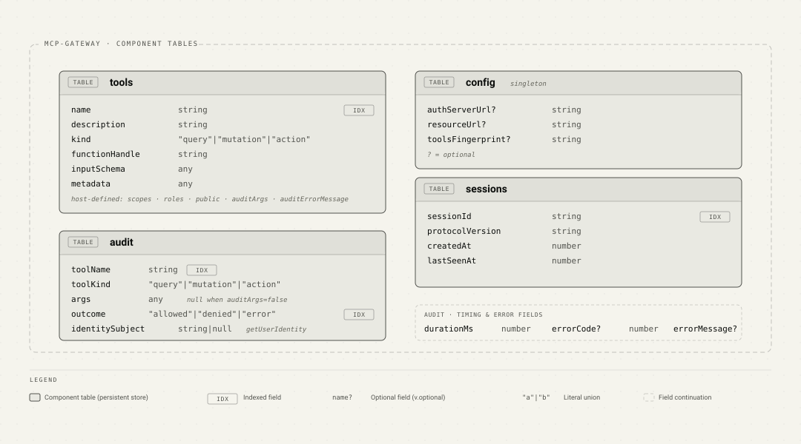

# Architecture

The gateway is a Convex component that owns its tool/resource registry,
configuration, audit, session, and subscription tables plus a tiny dispatch
action. The protocol surface
(`/mcp/`), the OAuth discovery route, and the policy decision (the
authorize callback) all live in the **host's** `httpAction` context, not
in the component.

## Why HTTP and authorize live in the host

Convex doesn't propagate `ctx.auth` into component code. The
JWT-validated identity (`ctx.auth.getUserIdentity()`) is only readable
from a host-mounted `httpAction`. Two consequences flow from this:

1. The gateway cannot mount `/mcp/` itself, because anything inside the
   `httpAction` would see `ctx.auth === undefined`. The host owns the
   route and calls `gateway.handleMcpRequest(ctx, request, { authorize })`.
2. The authorize callback runs in the host context (where identity is
   visible) before the component dispatches the tool. The component
   never sees identity directly; the host passes it down as an
   `auditIdentitySubject` string for the audit row.

That split is the entire architecture in one paragraph.

## High-level


The split:

- **Component**: storage (tools, resources, resource templates, config,
  audit, sessions, subscriptions) and a thin
  dispatch action that runs a tool by name and writes audit rows. It
  has zero opinions about scopes, roles, or which tools are public.
- **Host**: the `/mcp/` HTTP route, the authorize callback (one JS
  function that decides per call), the actual business-logic functions
  registered as tools, and the OAuth discovery route mounted at the
  RFC 9728 canonical path.
- **Client library code** (shipped inside the npm package, runs in the
  host): `handleMcpRequest` is the JSON-RPC envelope, session lifecycle,
  content negotiation, and the bridge between identity + authorize +
  component dispatch. It is part of the gateway from a developer's
  perspective but executes inside the host's `httpAction` so it can
  read `ctx.auth`.

The component cannot reach the host's tables directly; everything goes
through `createFunctionHandle` references the host supplies, either via
the declarative `tools` option of `handleMcpRequest` or the imperative
`gateway.register`. The host never imports component internals; it only
sees `components.mcpGateway.<module>.<function>` plus the `McpGateway`
client class.

## Data model



Seven tables, all owned by the component:

- `tools` is a per-tool row keyed by `name`. `functionHandle` is the
  opaque reference returned by `createFunctionHandle(fn)` and dispatched
  with `ctx.runQuery / runMutation / runAction`.
- `config` is a singleton row holding the OAuth metadata plus the
  `toolsFingerprint` of the last declarative `tools` sync (so the host
  can skip rewriting the registry when the list is unchanged).
  Authorization itself is **not** stored here: it lives in the host as a
  regular JS callback passed to `gateway.handleMcpRequest`.
- `sessions` is the MCP Streamable HTTP session table. One row per
  active client, keyed on the cryptographically random session id the
  server issued during `initialize`. The row also stores the
  negotiated protocol version and a `lastSeenAt` timestamp for
  idle-pruning via `gateway.pruneSessions` if the host wants it.
- `audit` grows linearly with `tools/call` traffic. Two indexes
  (`by_toolName`, `by_outcome`) keep the most common queries cheap.
- `resources` and `resourceTemplates` store the component-level catalog for
  imperative registrations. Declarative providers remain host-side because
  their read functions are executable handles.
- `subscriptions` records legacy resource subscription intent. The component
  does not provide a durable push connection; hosts own notification delivery.

## MCP Streamable HTTP transport

The host-mounted `handleMcpRequest` supports two protocol eras on the same
`/mcp/` endpoint. Legacy 2025-03-26, 2025-06-18, and 2025-11-25 requests
retain the session lifecycle below; `initialize` negotiates the newest
supported revision (2025-11-25) when a client requests one the gateway
does not speak. All three legacy revisions share one wire contract:
2025-11-25's additions over 2025-06-18 are optional and not emitted here.
Its SSE resumability framing (a priming event plus `retry` hint) is
emitted by the reference server only when it has an event store backing
GET + `Last-Event-ID` replay; this gateway has neither an event store
nor a GET channel (GET is a hard 405), so emitting a priming event would
advertise resumability it cannot honor — a client whose connection died
mid-frame would reconnect via GET, get 405, and silently abandon the
request. Not emitting the optional additions is conforming, and it keeps
every legacy revision's SSE frame identical (one message event, id 1).
The revision's additive capabilities (tasks, url-mode elicitation) are
likewise not advertised. A 2026-07-28 POST is stateless when both
`MCP-Protocol-Version` and
`params._meta["io.modelcontextprotocol/protocolVersion"]` equal
`2026-07-28`; it must also mirror its JSON-RPC method in `Mcp-Method` and,
for `tools/call`, `resources/read`, and `prompts/get`, its target in
`Mcp-Name`. Modern `_meta` requires `clientCapabilities`; `clientInfo` is
optional, but when present must contain its name and version.

Modern requests do not create, read, touch, delete, or return a session id.
They use `server/discover` for server metadata and capabilities, and the
declarative catalog is synchronized before discovery or dispatch. The legacy
wire contract remains unchanged: `initialize` always uses the session path,
including when a client incorrectly includes modern metadata.

### Stateless multi-round trips (MRTR)

The host-side `beforeCall` hook of a declarative tool is the MRTR state
machine. It runs after authorization but before component dispatch, on
the first call AND on every verified continuation, and returns one of
three decisions: `inputRequired()` (ask the client for input — again,
if a previous answer was incomplete, up to a hard round ceiling),
`completeCall()` (finish the call without dispatching, e.g. a declined
confirmation), or `null`/`undefined` (continue to the Convex function).
The underlying function therefore stays MCP-unaware: it never parses
input-response envelopes, and the only gateway-injected argument is the
chain's stable idempotency key (`mrtrArgs`), which is audited like any
other argument and which tools persist around their side effect for
durable replay protection.

Each round the gateway signs a short-lived `requestState` over the tool
name, a digest of the public arguments (computed before the hook runs,
so hook-side mutation cannot poison it), the authenticated caller
subject, the chain's idempotency key, the round number, and a fresh
continuation id. On retry it verifies all of these, then **redeems the
continuation id once** in the component's `mrtrRedemptions` table:
re-sending byte-identical responses is an idempotent replay, while a
captured `requestState` replayed with different responses is rejected,
so a resolved decision (a decline) cannot be flipped into an accept
within the TTL. Hosts prune expired redemption rows with
`gateway.pruneMrtrRedemptions` from a cron.

Fail-closed rules: a registry row registered as MRTR-gated (it had a
hook, or reserves `mrtrArgs`) is refused with `-32603` when served by a
handler that has no matching `beforeCall` — imperative registrations
and stale declarative catalogs can never dispatch without the promised
confirmation. The hook runs on every transport, so required input is
never silently bypassed: a legacy 2025-era request that reaches a hook
demanding input is rejected with `-32601` (and a modern request without
the `mrtr` option fails closed with `-32603`). Tools with a hook reject
anonymous callers through the same audited denial path as
`identityArg` tools (real 401 + `WWW-Authenticate`). The gateway checks
the current request's `clientCapabilities` before returning input
requests — per elicitation mode, accumulated across all requests of the
round — and reports `-32021` carrying only the missing capabilities. A
misconfigured signing secret surfaces as `-32603`, never as a client
error. State-only continuations remain valid without `inputResponses`.

Audit posture, stated explicitly: rounds that end gateway-side (an
`input_required` response, a declined confirmation completed by the
hook, a `-32021` capability rejection, a hook failure) write no audit
rows, because nothing is dispatched and only the component writes tool
audit entries. The audit log records authorization denials and actual
dispatches — including the injected idempotency key, which links a
dispatched call back to its confirmation chain. Hosts that need
per-round visibility log from inside their hook.

The table below describes the **legacy** session lifecycle. Modern
requests use `POST` only; `GET` and `DELETE` play no part in them.

| Method | Purpose | Notes |
|---|---|---|
| `POST /mcp/` | Send a JSON-RPC message | Legacy: first call must be `initialize`, subsequent calls require `Mcp-Session-Id`. Modern: no session, each request stands alone |
| `GET /mcp/` | Open server-initiated SSE channel | Returns `405 Method Not Allowed`; we don't push notifications yet |
| `DELETE /mcp/` | Terminate session | Drops the session row; subsequent requests with that id get `404` |

Two response shapes for `POST` are both supported. The server picks
based on the client's `Accept` header:

- `Accept: application/json` → JSON envelope (default, simplest)
- `Accept: text/event-stream` → single-frame SSE response with the same
  payload wrapped in an event. Used by clients that prefer streaming
  transport even for short responses; ready for future progress
  notifications without protocol change. Legacy frames carry an event
  id; modern ones do not, because `2026-07-28` removed `Last-Event-ID`
  resumability. Both set `X-Accel-Buffering: no` so reverse proxies
  don't hold the frame back.


Sessions are required after `initialize` (HTTP `400` on missing
header). The server may also terminate a session at any time; clients
that get `404` on a previously valid session id MUST start a fresh
`initialize`. The component never garbage-collects sessions on its own;
the host can schedule `gateway.pruneSessions(ctx, idleMs)` from a
cron if needed.

### Registry sync

When the host passes the declarative `tools` option to
`handleMcpRequest`, the registry is reconciled on each legacy
`initialize` and before every modern request, since a stateless request
has no handshake to hang the sync on. The sync is change-detected: the
gateway fingerprints the list (function names + schemas + protocol
metadata + metadata, no handle creation) and compares it against the
`config.toolsFingerprint` stored at the last sync. On a match it does
nothing, so the steady-state cost is a single cheap lookup; only an
actual change triggers the atomic `replaceTools`.

A malformed catalog (a duplicate tool name, an `x-mcp-header`
annotation that isn't statically reachable through `properties`, or a
schema whose local `$ref`s cannot be resolved within the bounded
budgets: unknown or non-local references, cycles, adjacent keywords
beside `$ref`, depth/expansion/size overruns, or a reference surviving in
a position the resolver cannot inline) fails the sync loudly and
logs which list is at fault. That is deliberate: a declarative catalog
is all-or-nothing, and silently dropping the offending tool is exactly
the drift this API exists to prevent. It does mean one bad entry takes
the endpoint down until the list is fixed.

Schema `$ref` resolution happens once, at registration: the registry
stores and `tools/list` advertises the inlined, self-contained schema
(schemas with no schema-position reference pass through verbatim).
Inlining rather than passing `$ref` through is a security decision as
much as a compatibility one: the runtime `Mcp-Param-*` header walk does
not follow references, so storing the resolved schema guarantees an
annotation validated at registration is the same one enforced per call,
and clients that do not resolve references still get a usable schema.

Two properties keep that honest. Resolution is reachability-driven —
definition containers are consumed on demand and dropped from the
output, so an unused definition (a recursive type or remote `$ref` in a
generated bundle) can neither fail the catalog nor consume budget. And a
position-independent post-walk scan rejects any reference that survives
anywhere in the result, because the definitions it pointed at are gone;
that check deliberately shares no keyword tables with the walker, since
a check derived from the walker's own notion of "schema position" could
never catch a position the walker overlooked. Because the fingerprint is
computed over authored schemas, the resolver's version is folded into it,
so changing resolution semantics re-syncs existing registries instead of
leaving them advertising stale resolutions.

Hosts that prefer to register imperatively omit `tools` and call
`gateway.register` from a mutation instead; the same validation runs
there, failing the mutation with the tool named.

## Request flow: `tools/call`


A few invariants worth pointing out:

- **Audit never alters the dispatch outcome.** Every audit write goes
  through `safeRecordAudit`, which logs and swallows its own failures.
  A successful tool mutation always returns `ok: true`, even if the
  audit row could not be inserted.
- **Audit is written *after* the tool handler returns**, outside the
  handler's try/catch, so a failing audit insert can never invert a
  committed mutation into a `-32000` error response.
- **Unknown-tool calls are not audited.** Anonymous callers can spam
  arbitrary names with arbitrary args; auditing them would let a
  drive-by attacker grow the `audit` table without bound.
- **Authorize throws are isolated.** They become `-32603` JSON-RPC
  errors with an audit entry, not HTTP 500s. The MCP client can recover.
- **Identity flows host-side only, by default.** The component receives
  `auditIdentitySubject: string | null` for audit purposes; the full
  identity object stays in the host. The one exception is a tool that
  opts in via `identityArg` (see [Identity propagation](#identity-propagation)):
  for those, the resolved caller `{ subject, claims }` is passed to
  `runTool` so the gateway can inject it into the named argument. It is
  never written to the audit log.

## Request flow: `tools/list`


The catalog visible to a caller is exactly the set of tools the
authorize callback would let them call. An unauthenticated client sees
only public tools, and an authenticated user without a particular role
never even sees the role-gated mutations in their tool list.

The callback is invoked once per registered tool (sequentially; a
throwing callback drops only that one tool from the list, not the whole
catalog). For 5 to 20 tools that is a non-issue; if your registry grows
large, move expensive checks into `metadata` (which the callback
receives without needing to re-read the registry).

## Identity propagation

Convex validates the inbound `Authorization: Bearer <jwt>` header
against your `auth.config.ts` before any function runs. Inside the
host's `/mcp/` `httpAction`:

- `handleMcpRequest` resolves the caller once at the boundary and reuses
  the result everywhere. Resolution order: `options.resolveIdentity(token)`
  if configured and a Bearer is present (the userinfo-bridge path), else
  Convex's `ctx.auth.getUserIdentity()` validated against your
  `auth.config.ts`. Either way the shape is
  `{ subject: string; claims?: Record<string, unknown> } | null`.
- The resolved `subject` becomes `auditIdentitySubject` for the audit
  row. The full identity is also handed to the authorize callback as
  `args.identity` (so the callback works in both bridge and pure-JWT
  modes).
- The audit row stores `identity.subject` (or `null` for anonymous).


### Injecting the caller into a tool (`identityArg`)

Tool handlers invoked via `dispatch.runTool` run inside the component,
where `ctx.auth` is **not** available, so a dispatched tool cannot read
the caller from the token. The supported channel is `identityArg`:

- Declare an argument with `mcpCallerValidator` (shape
  `{ subject: string; claims?: any }`) and name it in the tool's
  `identityArg`.
- At registration, the gateway removes that argument from the advertised
  `inputSchema`, so clients never see it.
- At request time, any client-supplied value for that argument is
  stripped (no spoofing), and the gateway injects the identity it
  resolved at the boundary right before dispatch.
- A tool that declares `identityArg` structurally needs a caller. If
  none was resolved, the call is denied as `-32001 Unauthorized` (both
  in the host handler and again inside `runTool`, so a direct component
  call can't inject `null` and trip the function's arg validator). The
  tool never runs unscoped.
- The injected argument is stripped before the audit write, so the
  caller and its claims never reach the audit log; the subject is still
  recorded in the audit row's dedicated `identitySubject` column.

```ts
// convex/invoices.ts
export const whoami = query({
  args: { caller: mcpCallerValidator },
  handler: async (_ctx, { caller }) => ({ subject: caller.subject }),
});

// convex/mcp.ts
defineMcpQuery({
  name: "invoices_whoami",
  fn: api.invoices.whoami,
  args: { caller: mcpCallerValidator },
  identityArg: "caller", // gateway fills `caller`; clients can't send it
}),
```

Whatever JWT issuer you already use (Clerk, Auth0, Pocket-ID, custom)
keeps working without glue code.

## Why some component functions are `mutation` not `internalMutation`

If you read the source you will notice that `audit.recordEntry`,
`registry.*`, and `dispatch.*` are declared as `mutation` / `query` /
`action` rather than the `internal*` variants. This is intentional and
specific to Convex components.

Generated component API references (`api`, `internal` exported from
`_generated/api.ts`) are both backed by `anyApi` at runtime, which
strips the public/internal marker. A component that calls its own
`internalMutation` via `internal.audit.recordEntry` fails at runtime
with `Couldn't resolve api.audit.recordEntry`. Declaring the function as
public `mutation` fixes the resolution; the component boundary still
prevents external callers from invoking it (only the host can reach
`components.mcpGateway.audit.recordEntry`, and the host already trusts
itself).

## Failure modes summary

| Failure | What the gateway does |
|---|---|
| Tool not registered | `-32602 Unknown tool` (no audit row) |
| Authorize returns `allowed: false` | `-32001 Unauthorized` if reason starts `Unauth*`, else `-32003 Forbidden`. 401 also gets `WWW-Authenticate`. (audit `denied`) |
| Authorize throws | `-32603 Authorizer threw: ...` (audit `error`) |
| Authorize returns malformed shape | Treated as `allowed: false` with explanatory reason (audit `denied`) |
| Tool handler throws | `-32000` with the error message (audit `error`) |
| Audit-write fails | Logged via `console.error`, swallowed. Dispatch outcome unchanged. |
| Session id missing on a non-`initialize` request | HTTP 400 |
| Session id unknown / terminated | HTTP 404 (forces fresh `initialize`) |
| Anonymous POST with `requireAuth: true` | HTTP 401 (+ `WWW-Authenticate` when OAuth is configured) before session handling, so browser clients begin OAuth. Opt-in; see [oauth.md](./oauth.md#all-private-servers-and-browser-clients-requireauth) |
| Declarative `tools` sync fails on `initialize` (e.g. duplicate tool name) | `initialize` fails loudly; cause logged via `console.error` with the `[mcp-gateway]` prefix |

## Going deeper

- [authorization.md](./authorization.md) for the authorize-callback
  contract, modes, and metadata-driven scope/role recipes
- [oauth.md](./oauth.md) for the OAuth 2.1 protected-resource discovery
  flow
- [audit-log.md](./audit-log.md) for audit reading, redaction, and
  pruning
- [testing.md](./testing.md) for `convex-test` patterns specific to this
  component
